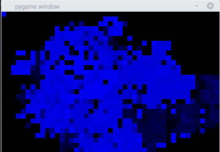

# Retroizer
Basically, a CLI tool to make images look retro. 

<h2 id="examples">Examples</h2>
The most basic thing you can do with Retroizer is
retroize a file. Let's say you have a file, hobbes.gif.
It looks like this: 
 
To view a retroized version, simply run 
<code>python3 retroizer.py hobbes.gif</code> 
You should see something like this (I aim to fix the glitchy colors in future versions: 
 

Well, that's all well and good, but what if <u><i><b>you</b></i></u>
want to be retroized? Do you take a picture of
yourself and retroize it? No! Webcam to the rescue!
If you just put "webcam" for the filename, a
live stream will be used for retroization.
All you need to do is something like this: 
<code>python3 retroizer.py webcam</code> 
The result will be a livestream of yourself,
but pixelated.

Now something more interesting: Changing the
pixelation level! To do this, simply use the
-s option. The value specifies the size of the 
pixels. While we are discussing options, here
are some others: 
<ul>
  <li>-x, -y: specifiy the starting x and y for draw the retroized image.</li>
  <li>-w, --width, --height: specify the window size.</li>
  <li>--flip: toggle flipping the image horizontally.</li>
  <li>-v, --verbose: echo a bunch of info about the process.</li>
  <li>-o, --output: specifiy the output file to write to.</li>
</ul>

Well, that's all. Feel free to improve this repo,
and enjoy!

